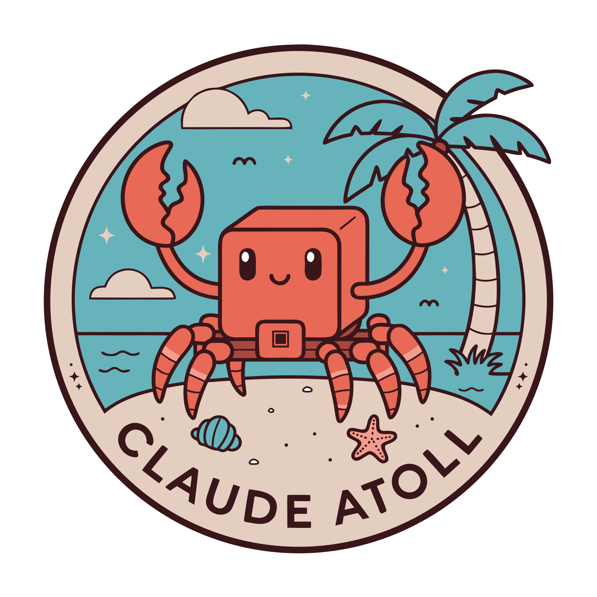
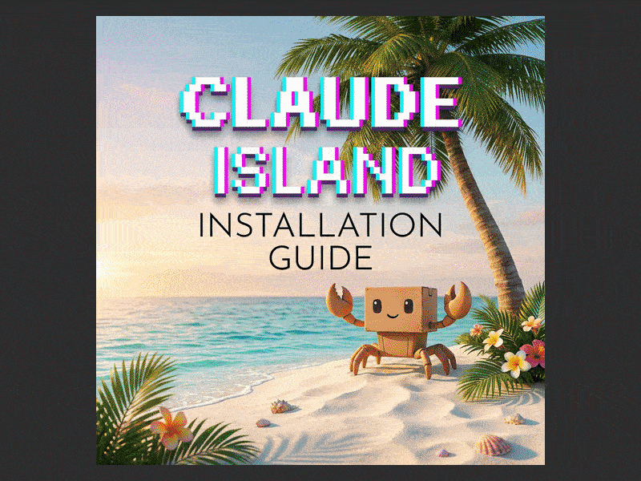

<div align="center">
  
  <p>
    <a href="https://github.com/engels74/claude-island/releases/latest" target="_blank" rel="noopener noreferrer">
      
    </a>
    <a href="#" target="_blank" rel="noopener noreferrer">
      
    </a>
    <a href="https://opensource.org/licenses/Apache-2.0" target="_blank" rel="noopener noreferrer">
      
    </a>
    <a href="#" target="_blank" rel="noopener noreferrer">
      
    </a>
    <a href="https://deepwiki.com/engels74/claude-island">
      
    </a>
  </p>
  <p align="center">
    中文 | <a href="README.md">English</a>
  </p>
  <h3 align="center">Claude Island</h3>
  <p align="center">
    一款 macOS 菜单栏应用，为 Claude Code CLI 会话带来灵动岛风格的通知体验。
  </p>
</div>

## 功能特性

- **Notch UI** —— 从 MacBook 刘海区域展开的动态悬浮层
- **实时会话监控** —— 同时跟踪多个 Claude Code 会话状态
- **权限审批** —— 直接在刘海界面批准或拒绝工具执行请求
- **聊天记录查看** —— 浏览完整对话历史并渲染 Markdown
- **自动安装 Hooks** —— 首次启动时自动安装所需 hooks

## 关于这个 Fork

这是原始项目 [claude-island](https://github.com/farouqaldori/claude-island) 的一个 fork，原作者为 farouqaldori。

这个 fork 的主要改进包括：

- **代码质量** —— 引入严格的 SwiftFormat、SwiftLint（70+ 规则）、pre-commit hooks，以及现代 Swift 并发实践（`@Observable`、`Sendable`、结构化并发）
- **Bug 修复** —— 包含多项稳定性与可靠性改进
- **已合并上游 PR** —— 可在 [merged pull requests](https://github.com/engels74/claude-island/pulls?q=is%3Apr+is%3Amerged+) 查看集成详情

## 系统要求

- macOS 15.6+
- Claude Code CLI

## 安装指南

### 第一步 —— 安装应用

从 [GitHub Releases](https://github.com/engels74/claude-island/releases/latest) 下载最新 `.dmg`，打开后将 **Claude Island** 拖入 **Applications**。 [`IMG`](docs/screenshots/cropped/001.png)

### 第二步 —— 绕过 Gatekeeper

Claude Island 当前使用 ad-hoc 签名，尚未 notarize，因此 macOS 首次启动时会阻止打开。

1. 打开应用后，macOS 会显示 **"Claude Island" Not Opened**，点击 **Done**。 [`IMG`](docs/screenshots/cropped/002.png)
2. 前往 **System Settings → Privacy & Security**，找到被拦截提示，点击 **Open Anyway**。 [`IMG`](docs/screenshots/cropped/003.png)
3. 在确认弹窗中点击 **Open Anyway**。 [`IMG`](docs/screenshots/cropped/004.png)
4. 使用 Touch ID 或系统密码完成授权。 [`IMG`](docs/screenshots/cropped/005.png)

### 第三步 —— 授予 Keychain 访问权限

macOS 会提示访问 **"Claude Code-credentials"**。这是 Claude Code CLI 的 OAuth token，Claude Island 用它来提供可选的 usage quota 跟踪功能。建议点击 **Always Allow**。 [`IMG`](docs/screenshots/cropped/006.png)

### 第四步 —— 授予辅助功能权限

1. 应用会显示 **Accessibility Permission Required** 对话框，点击 **Open Settings**。 [`IMG`](docs/screenshots/cropped/007.png)
2. 在 **System Settings → Privacy & Security → Accessibility** 中点击 **+**。 [`IMG`](docs/screenshots/cropped/008.png)
3. 打开 **Applications**，选择 **Claude Island**，然后点击 **Open**。 [`IMG`](docs/screenshots/cropped/009.png)
4. 确认 Claude Island 已出现在辅助功能列表中，并且开关处于开启状态。 [`IMG`](docs/screenshots/cropped/010.png)

> **提示：** 如果 Claude Island 已经在列表里但仍然无法工作，可以先将其移除（点击 **−**），再按上面的步骤重新添加。

后续启动通常不再需要重复这些设置。Sparkle 自动更新也会正常工作。

**想了解权限用途？** 可以查看这篇说明：[why Claude Island needs accessibility and keychain permissions](https://deepwiki.com/search/is-claude-island-safe-to-use-i_b6aed731-54db-4ac4-89e5-7ce9ad984006)。

### 备选方式：终端绕过 Gatekeeper

如果你更倾向于使用终端，也可以移除 quarantine 属性来跳过上面的 Gatekeeper 步骤：

```bash
xattr -d com.apple.quarantine "/Applications/Claude Island.app"
```

### 备选方式：从源码构建

```bash
xcodebuild -scheme ClaudeIsland -configuration Release build
```

如果你需要完整的本地开发工具链，仓库当前使用的命令如下：

```bash
# Build (release, ad-hoc signed)
./scripts/build.sh

# Build via Xcode directly
xcodebuild -scheme ClaudeIsland -configuration Release build

# Lint (strict mode — warnings are errors)
swiftlint lint --strict ClaudeIsland/

# Auto-format
swiftformat ClaudeIsland/

# Run all pre-commit checks
prek run --all-files

# Install pre-commit hooks (one-time setup)
prek install --hook-type pre-commit --hook-type pre-push

# Create DMG (local testing, no notarization/GitHub/website)
./scripts/create-release.sh --skip-notarization --skip-github --skip-website --skip-sparkle
```

依赖安装：

```bash
brew install swiftformat swiftlint shellcheck create-dmg
```

### 安装演示



## 使用方式

1. 启动 Claude Island。
2. 正常在终端中运行 Claude Code CLI。
3. 首次启动后，Claude Island 会自动安装并接管 `~/.claude/hooks/` 中需要的 hooks。
4. 当 Claude 会话产生状态变化、工具请求或需要审批时，刘海区域会自动展开显示对应内容。
5. 如果 Claude 请求运行某个工具，你可以直接在界面中点击批准或拒绝，而不必切回终端。

## 工作原理

Claude Island 会在 `~/.claude/hooks/` 中安装 hooks，并通过 Unix socket 将会话状态发送给应用。应用监听这些事件后，在 notch overlay 中显示对应的状态与交互界面。

当 Claude 需要工具权限时，刘海区域会展开并显示 approve/deny 按钮，因此你无需频繁切换回终端。

## 常见问题

### 1. 为什么应用第一次打不开？

因为当前发布包是 ad-hoc 签名且未 notarize，macOS 会默认拦截首次启动。按上面的 Gatekeeper 步骤放行即可。

### 2. 为什么需要 Accessibility 权限？

项目需要通过系统层交互把批准/拒绝操作发送回正确的 Claude Code 会话，因此需要辅助功能权限。

### 3. 为什么会请求 Keychain 权限？

这是为了读取 Claude Code CLI 的 OAuth token，并支持可选的 usage quota 跟踪。若你不关心这部分能力，也可以先拒绝，再根据实际需要重新授权。

### 4. 支持自动更新吗？

支持。仓库集成了 Sparkle，后续启动时自动更新可以正常工作。

### 5. 可以只从源码运行吗？

可以。你可以直接使用 Xcode 或 `xcodebuild -scheme ClaudeIsland -configuration Release build` 来构建项目。

## License

Apache 2.0
